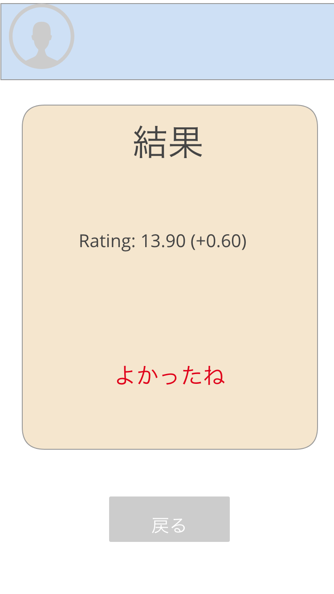

# 仕様
### トップ


はじめのページ。`メールアドレス`, `パスワード` を入力してユーザー作成 or ログインでログイン  
`EmailInput`, `PasswordInput` を `Firebase Auth` にわたす。返却された `credential` の `uid` をユーザーIDとする。
ユーザーデータは `Firestore` に保存。(v1では実装しない)

### ホーム


ログイン後に遷移するページ。ユーザー情報とランダムマッチを行うボタンがある。  
`Firestore` からのユーザー情報を表示(v1では実装しない)。  
`"ランダムマッチ" ボタン` を押すと gRPCのAPI `WordWar.Game(uid)` が呼ばれ、ゲーム終了時まで継続する `Server Streaming` がはられる。
サーバー側では部屋にマッチング(v1では1部屋4人)し、RedisのKVS?を作る。
クライアント側はゲーム画面に遷移する。  
**[疑問]: マッチングした相手のユーザー情報は `GameResponse` にはいっていないのか**

### ゲーム


マッチングが完了すると遷移するページ。60秒間?の間対戦が行われる。(v1では10回発言されたら終わり)  
入力フォームはひらがなのみ可。入力されると gRPCのAPI `WordWar.Say(uid, message)` が呼ばれ, 発言した内容がResponseとして返ってくる。(v1ではしりとりとして有効かどうかを判定しない)  
サーバー側では発言内容がRedis KVS に書き込まれ、Pub/Sub によってルームメンバーに周知される。(全員にGameResponseを送る?)
ゲーム終了時、`WordWar.Game` ストリームが切断され、結果画面に遷移する。

### 結果


結果画面。ゲームの結果を表示する。
gRPCのAPI `WordWar.Result(uid)` が呼ばれ、サーバー側ではuidから対戦のスコアを返却する。この際スコアに応じてレーティングが変動する(v1では未実装)。  
戻るボタンでホーム画面に遷移。

# 開発フロー
- リポジトリ : [i-pu/word-war](https://github.com/i-pu/word-war)
- スキルスタック : Elm + Go + gRPC + Redis + Firebase
- タスク管理 : [Asana](https://app.asana.com/0/1141553269504005/board)
- Firebase : [firebase console](https://console.firebase.google.com/project/word-war-9e392/hosting?hl=ja)

コミュニケーションはSlack上で, タスク管理はAsanaでやりたい。
1スプリント1週間とし、機能提案から実装、リリースのサイクルを作りたい。

# フロントエンドのTips
## SPAの参考リポジトリ
比較的シンプルめのSPAということで以下を参考にしています。
[elm-my-spa](https://github.com/takmatsukawa/elm-my-spa)

## Firebase
認証の部分とホスティングとユーザーデータの保存はFirebaseにより行います。 [Firebaseコンソール](https://console.firebase.google.com/project/word-war-9e392/hosting/main?hl=ja)

## CSS
CSSフレームワークとして [Bulma](https://bulma.io/) を用いています。
公式ドキュメントにはHTMLによる例が載っているのでそれを参考に画面を作ってください。なお、HTMLからElmへの変換ツールとして [HTML to Elm](https://marketplace.visualstudio.com/items?itemName=Rubymaniac.vscode-html-to-elm)というVSCodeの拡張機能を利用することを推奨します。

# サーバーサイドのTips
## `Clean Architecture` っぽい何か
[これ](https://medium.com/@hatajoe/clean-architecture-in-go-4030f11ec1b1)
を参考にそれっぽく作りました。

### ディレクトリ構成
```bash
$ tree -L 2
.
├── domain
│   ├── entity
│   ├── repository
│   └── service
├── interface
│   ├── memory
│   └── rpc
├── usecase
└── main.go
```
`domain` が一番内側の部分になります。

`interface/memory` は `domain/repository` の実装のつもりです。

`interface/rpc` にgRPCの `rpc` を記述します。
`rpc` は `usecase` で定義してある関数を呼ぶことになります。

grpcにおけるサービスとCAにおけるサービスとで2つサービスがあるので文脈に注意です。

いまの構成は不完全な部分があるので少しずつ直すことになります。

## Redis `Pub/Sub`
[`redigo`](https://github.com/gomodule/redigo)を使います。
`key` の名前と値の構造形式は **TODO**
